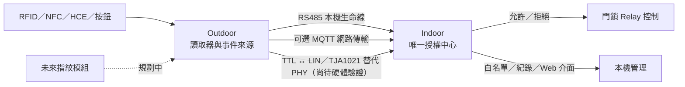

# ESP32 智慧門禁系統（Access Control System）

> 此 repository 為公開展示與技術文件用途。實際 firmware 開發 repository 為 private，並不在此 repository 公開。

這是一套以 ESP32 為核心、為傳統多戶型對講機增加智慧門禁能力的展示專案。Indoor 維持唯一授權中心，Outdoor 負責讀取憑證與按鈕事件，再透過受保護的本機或網路傳輸回報。

## 高階架構

RS485 是目前已驗證的本機傳輸基準；TTL ↔ LIN／TJA1021 仍是尚待硬體驗證的替代實體層。無論傳輸方式為何，最終授權與 Relay 控制都由 Indoor 負責。

## 為什麼同時保留 RS485 與 LIN？

兩者不是技術高下之分，而是對應不同的現場配線條件：

| 項目 | RS485／MAX3485 | TTL ↔ LIN／TJA1021 |
|---|---|---|
| 本專案定位 | 主要本機生命線 | 線芯不足時的替代 PHY |
| 訊號方式 | 差動 A／B | 單線 LIN 加共同 GND 參考 |
| 資料訊號線需求 | 2 芯 | 1 芯 LIN 資料線 |
| 抗干擾與適用性 | 抗干擾能力較強，適合優先採用 | 較依賴共同接地與實際配線環境 |
| 適用情境 | 現場可提供足夠線芯時 | 既有對講機線芯不足的既有系統改造情境 |
| 本專案狀態 | ✅ 已驗證基準 | 🧪 硬體驗證待完成 |
| 上層協議 | 本專案自訂協議 | 本專案自訂協議；TJA1021 僅作 PHY |

若既有配線允許，RS485／MAX3485 仍是本專案的優先選擇，因為差動傳輸在抗干擾與通訊可靠性上較有優勢。部分既有多戶型傳統對講機的可用線芯非常有限，可能無法再提供 RS485 所需的 A／B 兩條資料線，因此另外評估 TTL ↔ LIN／TJA1021，預期將資料訊號需求由兩芯降低為一芯 LIN 加既有共同 GND 參考。此替代方案尚未完成實機硬體驗證，也不表示已取代 RS485。

## 核心功能

- ESP32 Indoor／Outdoor 架構
- RFID／NFC 與 Android HCE
- Indoor 白名單授權
- Relay 控制門鎖解鎖
- RS485／MAX3485 本機傳輸（已驗證基準）
- TTL ↔ LIN／TJA1021 替代 PHY（尚待硬體驗證）
- MQTT 可選網路傳輸
- Web 設定介面與 OTA（僅高階描述）
- R503S 指紋模組規劃，並保留 R503／AS608 相容方向

狀態標記：✅ 已完成／已驗證、🧪 實驗中／尚待硬體驗證、📋 規劃中。

## 文件

- [系統架構](docs/architecture.md)
- [硬體](docs/hardware.md)
- [傳輸方式](docs/transports.md)
- [發展路線](docs/roadmap.md)

此公開 repository 不包含 firmware 原始碼、production 設定、credentials、source hash manifest 或內部開發指令。

## 參考資料

本專案為獨立設計與實作；下列官方文件、上游函式庫與開源專案主要用於硬體規格、API、協議行為及相容性驗證。列為參考資料不代表本專案直接採用或複製其完整架構。

- [Espressif Arduino Core for ESP32](https://github.com/espressif/arduino-esp32)：ESP32 Arduino 平台參考。
- [Espressif ESP-MQTT](https://github.com/espressif/esp-mqtt)：MQTT client 與 lifecycle API 參考。
- [Adafruit PN532](https://github.com/adafruit/Adafruit-PN532)：PN532 reader 參考。
- [Elechouse PN532 Android HCE example](https://github.com/elechouse/PN532/blob/PN532_HSU/PN532/examples/android_hce/android_hce.ino)：PN532 與 Android HCE／APDU 互動的補充參考。
- [Android Developers — Host-based Card Emulation](https://developer.android.com/develop/connectivity/nfc/hce)：Android HCE、AID、APDU 與 ISO-DEP 官方參考。
- [Adafruit Fingerprint Sensor Library](https://github.com/adafruit/Adafruit-Fingerprint-Sensor-Library)：主要 fingerprint library 參考。
- [R503 Fingerprint Sensor Library](https://github.com/mpagnoulle/R503-Fingerprint-Sensor-Library)：R503 protocol／capability 補充參考。
- [NXP TJA1021 官方產品文件](https://www.nxp.com/products/interfaces/lin-transceivers/standard-lin/lin-transceiver:TJA1021)：TTL ↔ LIN／TJA1021 PHY 參考。
