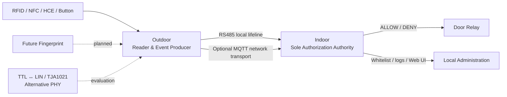

# ESP32 Access Control System

> 此 repository 為公開展示與技術文件用途。實際 firmware 開發 repository 為 private，並不在此 repository 公開。

這是一套以 ESP32 為核心、為傳統多戶型對講機增加智慧門禁能力的展示專案。Indoor 維持唯一授權 authority，Outdoor 負責讀取 credential 與按鈕事件，再透過受保護的 local 或 network transport 回報。

## 高階架構

RS485 是目前 validated local baseline；TTL ↔ LIN／TJA1021 仍是待硬體驗證的 alternative PHY。無論 transport 為何，最終授權與 Relay control 都由 Indoor 負責。

## 核心功能

- ESP32 Indoor／Outdoor architecture
- RFID／NFC 與 Android HCE
- Indoor whitelist authorization
- Relay controlled door unlock
- RS485／MAX3485 local transport（validated baseline）
- TTL ↔ LIN／TJA1021 alternative PHY（hardware validation pending）
- MQTT optional network transport
- Web-based configuration 與 OTA（僅高階描述）
- Fingerprint R503S roadmap，並保留 R503／AS608 compatibility direction

狀態標記：✅ software implemented／validated、🧪 experimental／hardware validation pending、📋 planned。

## 文件

- [Architecture](docs/architecture.md)
- [Hardware](docs/hardware.md)
- [Transports](docs/transports.md)
- [Roadmap](docs/roadmap.md)

此公開 repository 不包含 firmware source、production configuration、credentials、source hash manifest 或內部開發指令。
