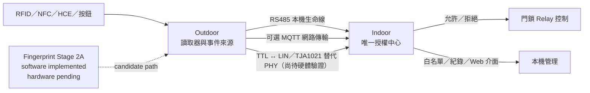

# ESP32 智慧門禁系統（Access Control System）

> 此 repository 為公開展示與技術文件用途。實際 firmware 開發 repository 為 private，並不在此 repository 公開。

這是一套以 ESP32 為核心、為傳統多戶型對講機增加智慧門禁能力的展示專案。Indoor 維持唯一授權中心，Outdoor 負責讀取憑證與按鈕事件，再透過受保護的本機或網路傳輸回報。

## 高階架構



RS485 是目前已驗證的本機傳輸基準；TTL ↔ LIN／TJA1021 仍是尚待硬體驗證的替代實體層。無論傳輸方式為何，最終授權與 Relay 控制都由 Indoor 負責。

## 為什麼同時保留 RS485 與 LIN？

兩者不是技術高下之分，而是對應不同的現場配線條件：

| 項目 | RS485／MAX3485 | TTL ↔ LIN／TJA1021 |
|---|---|---|
| 本專案定位 | 主要本機生命線 | 線芯不足時的替代 PHY |
| 訊號方式 | 差動 A／B | 單線 LIN 加共同 GND 參考 |
| 資料訊號線需求 | 2 芯 | 1 芯 LIN 資料線 |
| 抗干擾與適用性 | 抗干擾能力較強，適合優先採用 | 較依賴共同接地與實際配線環境 |
| 適用情境 | 現場可提供足夠線芯時 | 既有對講機線芯不足的既有系統改造情境 |
| 本專案狀態 | ✅ 已驗證基準 | 🧪 硬體驗證待完成 |
| 上層協議 | 本專案自訂協議 | 本專案自訂協議；TJA1021 僅作 PHY |

若既有配線允許，RS485／MAX3485 仍是本專案的優先選擇，因為差動傳輸在抗干擾與通訊可靠性上較有優勢。部分既有多戶型傳統對講機的可用線芯非常有限，可能無法再提供 RS485 所需的 A／B 兩條資料線，因此另外評估 TTL ↔ LIN／TJA1021，預期將資料訊號需求由兩芯降低為一芯 LIN 加既有共同 GND 參考。此替代方案尚未完成實機硬體驗證，也不表示已取代 RS485。

## 核心功能

- ESP32 Indoor／Outdoor 架構
- RFID／NFC 與 Android HCE
- Indoor 白名單授權
- Relay 控制門鎖解鎖
- RS485／MAX3485 本機傳輸（已驗證基準）
- TTL ↔ LIN／TJA1021 替代 PHY（尚待硬體驗證）
- MQTT 可選網路傳輸
- Web 設定介面與 OTA（僅高階描述）
- Fingerprint Stage 2A software path（硬體驗證待完成）

狀態標記：✅ 已完成／已驗證、🧪 實驗中／尚待硬體驗證、📋 規劃中。

## 本機 Web 與 mDNS

在正常 LAN 模式下，`.local` 網址是方便使用者找到裝置的 discovery 入口；以 `http://indoor.local/` 或 `http://outdoor-<ID>.local/` 開啟管理頁時，GET 導覽會轉向裝置當下的 private IPv4，讓登入與後續管理 session 直接建立在 IP host。DHCP 位址仍可能變動，`.local` 不代表固定 IP；Setup AP 與 POST／API mutation 維持原本行為。Indoor 初次設定仍使用 `Door-Setup`；已設定裝置即使 Wi-Fi 失聯，也不會自動開放無密碼 recovery AP。Recovery 需要 Indoor 實體 BOOT 操作授權，且只提供 bounded temporary setup window。

### 目前狀態摘要

| 項目 | 目前狀態 |
|---|---|
| RS485 | ✅ 已驗證的本機生命線基準 |
| PN532 RFID／NFC | ✅ 已實作的憑證候選來源 |
| Android HCE | ✅ 已有選定裝置整合證據；其他裝置驗證持續進行 |
| MQTT | 🧪 軟體架構與 deterministic validation 完整度高；live validation 部分完成 |
| Fingerprint | 🧪 Stage 2A software complete；hardware validation pending |
| PT Door State | 🧪 software／bench PASS；實際電氣 front-end pending |
| LIN PHY | 🧪 hardware validation pending |
| ESP32-C6 | 📋 future option；board validation pending |

## 適用對講機系統

本專案主要面向既有傳統四線式對講機的智慧門禁擴充，但不是所有四線式對講機的通用轉接器。不同品牌／型號仍可能有不同的接腳、電壓、極性，以及呼叫、開門或其他輔助訊號；實裝前必須個別實測確認。

| 品牌／系統 | 狀態 | 說明 |
|---|---|---|
| 銘陽牌傳統四線式對講機 | ✅ 實裝／驗證對象 | 主要測試環境之一 |
| 俞氏牌傳統四線式對講機 | ✅ 實裝／驗證對象 | 主要測試環境之一 |
| 明谷／機智傳統四線式對講機 | 🧪 待實測 | 具潛在實裝可能性，仍需確認個別型號電氣特性 |
| 其他四線式對講機 | 📋 個別評估 | 不保證即插即用相容 |

文中品牌與商標僅用於說明測試與相容性對象；本專案與相關原廠無隸屬、授權或合作關係。

## 既有呼叫線再利用

在既有傳統對講機線材不足時，原室外呼叫按鈕可改由室外端 GPIO 讀取，按鍵動作轉為 `ButtonEvent`，再透過室內端與室外端之間的資料傳輸方式送至室內端，最後由室內端呼叫繼電器重建原本的呼叫接點。如此一來，原本逐戶承載呼叫訊號的導線便有機會重新配置，降低重新拉線的需求。

```text
實體按鈕 → 室外端 GPIO → ButtonEvent
        → RS485 / 單線 LIN-like UART / MQTT
        → 室內端呼叫繼電器 → Relay COM/NO
        → 既有對講機呼叫迴路
```

這是既有配線再利用策略，不是新的通訊協定。不同四線式系統的呼叫電源、公共端、各戶獨立呼叫線、電壓、極性與接點額定值仍需個別確認。

## 文件

- [系統架構](docs/architecture.md)
- [硬體](docs/hardware.md)
- [傳輸方式](docs/transports.md)
- [發展路線](docs/roadmap.md)

此公開 repository 不包含 firmware 原始碼、production 設定、credentials、source hash manifest 或內部開發指令。

## 開發方式與專案規模

本專案採用 **AI-assisted development / vibe coding** 方式進行開發，主要透過 **ChatGPT** 與 **OpenAI Codex** 協作，形成 human-in-the-loop 的 AI-assisted engineering workflow。

- **開發者**：負責需求、硬體選擇、系統方向、實機量測與最終驗證。
- **ChatGPT**：協助架構、規格、技術討論、review 與開發任務拆解。
- **OpenAI Codex**：協助程式實作、測試／靜態驗證與 repository 維護。

AI 產生的程式與設計建議不會直接視為完成品；涉及門禁控制、ESP32、電氣介面與硬體通訊的內容，仍需經過實機測試、電氣量測及人工判斷後，才納入正式設計。本段不代表 OpenAI 贊助、認證或參與本專案的硬體安全決策。

### 專案規模

| 類別 | 檔案數 | 實體行數 |
| --- | ---: | ---: |
| ESP32 Firmware | 38 | 20,294 |
| 開發／驗證工具 | 45 | 5,740 |
| Android application | 9 | 424 |
| **程式與工具合計（含 Android）** | **92** | **26,458** |
| 技術文件 | 19 | 7,135 |

以上數字來自 private development repository 的 deterministic Git tracked physical-line aggregate，包含空白與註解；此 showcase 不公開 firmware source，並排除 Arduino Core、第三方函式庫、downloaded dependencies、build／cache 與 generated artifacts。

### Source synchronization

| 欄位 | 值 |
| --- | --- |
| Source repository | `https://github.com/masini1491/access-control-system.git` |
| Source branch | `main` |
| Private source baseline | `d78c623598130771b99fe6642d21fcbe5a44fddc` |
| Last synchronized | `2026-08-24` |

此 baseline 僅標示本次公開 aggregate/documentation 內容所依據的 private source snapshot；本 showcase 不包含 private firmware、secrets 或 internal paths。

## 參考資料

本專案為獨立設計與實作；下列官方文件、上游函式庫與開源專案主要用於硬體規格、API、協議行為及相容性驗證。列為參考資料不代表本專案直接採用或複製其完整架構。

- [Espressif Arduino Core for ESP32](https://github.com/espressif/arduino-esp32)：ESP32 Arduino 平台參考。
- [Espressif ESP-MQTT](https://github.com/espressif/esp-mqtt)：MQTT client 與 lifecycle API 參考。
- [Adafruit PN532](https://github.com/adafruit/Adafruit-PN532)：PN532 reader 參考。
- [Elechouse PN532 Android HCE example](https://github.com/elechouse/PN532/blob/PN532_HSU/PN532/examples/android_hce/android_hce.ino)：PN532 與 Android HCE／APDU 互動的補充參考。
- [Android Developers — Host-based Card Emulation](https://developer.android.com/develop/connectivity/nfc/hce)：Android HCE、AID、APDU 與 ISO-DEP 官方參考。
- [Adafruit Fingerprint Sensor Library](https://github.com/adafruit/Adafruit-Fingerprint-Sensor-Library)：主要 fingerprint library 參考。
- [R503 Fingerprint Sensor Library](https://github.com/mpagnoulle/R503-Fingerprint-Sensor-Library)：R503 protocol／capability 補充參考。
- [NXP TJA1021 官方產品文件](https://www.nxp.com/products/interfaces/lin-transceivers/standard-lin/lin-transceiver:TJA1021)：TTL ↔ LIN／TJA1021 PHY 參考。

## 授權

本 repository 中由作者自行撰寫的文件、圖表與展示內容，除另有註明外，採用 Creative Commons Attribution 4.0 International（CC BY 4.0）授權。

第三方專案、函式庫、商標、文件與引用內容，仍適用各自原始授權與權利聲明。CC BY 4.0 僅適用於本 public showcase repository 中由作者自行產生的文件、圖表與展示內容，不涵蓋 private firmware repository、第三方原始碼、第三方商標、NXP／Adafruit／Espressif 等第三方內容，或未公開的 production firmware source。

此授權不代表未公開的 private firmware source 採用相同授權。

[查看完整授權條款](LICENSE)
