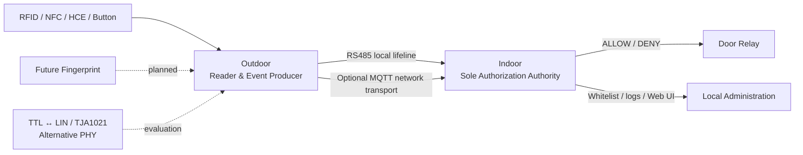

# ESP32 Access Control System

> 此 repository 為公開展示與技術文件用途。實際 firmware 開發 repository 為 private，並不在此 repository 公開。

這是一套以 ESP32 為核心、為傳統多戶型對講機增加智慧門禁能力的展示專案。Indoor 維持唯一授權 authority，Outdoor 負責讀取 credential 與按鈕事件，再透過受保護的 local 或 network transport 回報。

## 高階架構

RS485 是目前已驗證的本機傳輸基準；TTL ↔ LIN／TJA1021 仍是待硬體驗證的替代實體層。無論傳輸方式為何，最終授權與 Relay 控制都由 Indoor 負責。

## 為什麼同時保留 RS485 與 LIN？

兩者不是技術高下之分，而是對應不同的現場配線條件：

| 項目 | RS485／MAX3485 | TTL ↔ LIN／TJA1021 |
|---|---|---|
| 本專案定位 | 主要本機生命線 | 線芯不足時的替代 PHY |
| 訊號方式 | 差動 A／B | 單線 LIN 加共同 GND 參考 |
| 資料訊號線需求 | 2 芯 | 1 芯 LIN 資料線 |
| 抗干擾與適用性 | 抗干擾能力較強，適合優先採用 | 較依賴共同接地與實際配線環境 |
| 適用情境 | 現場可提供足夠線芯時 | 既有對講機線芯不足的 retrofit 情境 |
| 本專案狀態 | ✅ 已驗證基準 | 🧪 硬體驗證待完成 |
| 上層協議 | 本專案自訂協議 | 本專案自訂協議；TJA1021 僅作 PHY |

若既有配線允許，RS485／MAX3485 仍是本專案的優先選擇，因為差動傳輸在抗干擾與通訊可靠性上較有優勢。部分既有多戶型傳統對講機的可用線芯非常有限，可能無法再提供 RS485 所需的 A／B 兩條資料線，因此另外評估 TTL ↔ LIN／TJA1021，預期將資料訊號需求由兩芯降低為一芯 LIN 加既有共同 GND 參考。此替代方案尚未完成實機硬體驗證，也不表示已取代 RS485。

## 核心功能

- ESP32 Indoor／Outdoor architecture
- RFID／NFC 與 Android HCE
- Indoor whitelist authorization
- Relay controlled door unlock
- RS485／MAX3485 local transport（validated baseline）
- TTL ↔ LIN／TJA1021 alternative PHY（hardware validation pending）
- MQTT optional network transport
- Web-based configuration 與 OTA（僅高階描述）
- Fingerprint R503S roadmap，並保留 R503／AS608 compatibility direction

狀態標記：✅ software implemented／validated、🧪 experimental／hardware validation pending、📋 planned。

## 文件

- [Architecture](docs/architecture.md)
- [Hardware](docs/hardware.md)
- [Transports](docs/transports.md)
- [Roadmap](docs/roadmap.md)

此公開 repository 不包含 firmware source、production configuration、credentials、source hash manifest 或內部開發指令。
